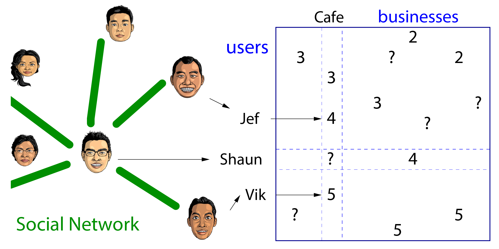
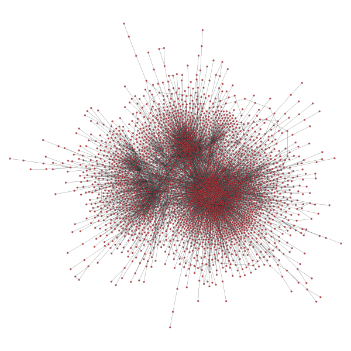
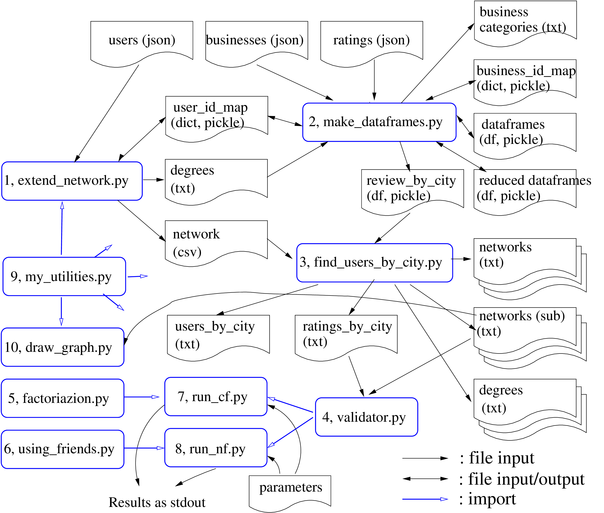

# Exploring Recommenders with Networks

## Introduction
With the big growth in online commerce in recent years, 
recommendation systems (recommenders) have become very popular.
Recommenders try to match certain *items* to specific *users*, based on
existing information, and usually show recommended items to users
in their web interface.

If there exist user attributes and item attributes, those information 
can be arranged in a shared space (featurization) 
so that user-item *distances* can be used to find out how well they match
(content-based methods).
If there exist ratings (usually in the scale of 1 to 5) given by users for
certain items, recommenders try to predict unknown ratings using past ratings.
An easiest method is to use average predictions for a given user-item pair
(biases of users and/or items can be considered, in addition).
But that might not be good enough, because we know that all users are not the
same; rather we users are quite diverse with many unique characteristics.
Then what we can do is using the user attributes to group
users, and then use members of the same group of the user
for predicting ratings (demographic filtering).
This type of methods will give us better predictions compared to using averages,
because we are now considering characteristics of diverse users.
Or we can compare users (or items) by looking at 
similarities between their past ratings to find out similar users (or
items) for predictions (collaborative filtering).
Each method has some drawbacks, which we will not go into detail here,
and most recommendation systems combine some existing methods to have better
results (hybrid models).

Another recent big trend is the growth and availability of huge social networks that
have the information of how users are connected with each other.
Then one can ask a question: if we use social networks in recommenders in
addition to methods described above, will the performance of recommenders be enhanced?
We already know the answer. The answer is yes; because we tend to become
friends with similar people, or we become similar with friedns by interacting
with them, and sharing information with them.
This is a well-known and obvious problem, and I believe
many computer scientists and data scientists have been tackling this problem
in academia and industry for sevaral years now[1-3]. 
Then the next question is: how do we incorporate network information into
recommenders?
Here I implement
and analyze the simplest approach of using past ratings of friends for predicting ratings.
<!--- 

--->

The above figure describes the method. If a user, named Shaun, has two friends, Jef
and Vik, who rated a business, named Cafe, we assume that Shaun's rating is
more likely to be closer to their ratings than the average rating.
To test the model, we will use the data from [Yelp Dataset
Challenge](http://www.yelp.com/dataset_challenge).

## Data

The data consist of five json files, and each file has information on
users, businesses, reviews (with ratings), tips, and check-ins.
The data is composed by Yelp to represent 10 cities: 
Phoenix, Las Vegas, Charlotte, Montreal, Edinburgh, Pittsburgh,
Madison, Karlsruhe, Urbana-Champaign, and Waterloo (ordered by the number of
businesses).
Even though there was no need for data cleaning, some preprocessing
had to be performed (see Appendix for technical details).
If I briefly describe the preprocessing:

1. We only need users, bussinesses, and ratings (from the file of reviews).
    Also we'd like to do some city-by-city analysis, so we will separate data
    into 10 subsets for each city.
2. First, each businsess was assigned a city by their location information. Due to the
   nature of the dataset, every business was classified cleanly.
3. Second, by going through every rating with user and business information, we
   were able to assign ratings and users to each city. One problem arises when
   there are users who left ratings on multiple cities (about 5% of users).
   In those cases, we looked at friends of these users, and found cities where
   the majority of friends reside. If there is no majority or there is not enough
    friends to determine, a city was assigned randomly.
4. Since we are only concerned with users who are in social network (with
   friends), we dropped users without any friend and their ratings from the
    dataset. The number of users is reduced from 366,715 to 174,094 here.
5. If we ignore network edges between users in different cities (about 22% of
   edges are dropped here), we now have 10 separate subsets of data. Here
    we further drop users by only keeping the biggest component of the
    network for each city. The number of users now has become 147,114.
    For example, the network (the biggest component) of Montreal with 3,071
    users and 9,121 edges look like below (using sfdp layout). 

Now we will briefly examine the city-by-city data (for more detailed analysis, 
look at
[EDA](https://github.com/suhanree/network-recommender/blob/master/code/EDA.ipynb),
done in ipython notebook format).
If we compare cities by counts, the figure below shows ratios for cities for 
numbers of users, businesses, and ratings.
There are two big cities, Phoenix and Las Vegas, and five medium cities, and
three small cities.

One thing that catches our eyes is that the number of users are the highest for
Las Vegas, even though the number of businesses is not the highest.
It also appears that the average degree for Las Vegas (around 12) is about twice as much
as average degrees for other cities (around 6).
Having more tourists alone cannot explain this phenomenon, and I can only
conclude that there are just more active users in Las Vegas, based on this
data. There may exist other outside factors I am not aware of.

Another interesting thing is that distributions of ratings are different for
some cities. Overall ratings are skewed toward 5 with the mean at 3.75.
But if we look at ratings distributions city by city, we can see a clear difference.

In Phoenix and Las Vegas, 5 is given the most, but in Charlotte and Montreal, 4
is the most given rating. Big cities are more generous? Maybe.
Now we turn our attention to the main focus of this project: a recommender with 
a social network.

## Model

## Results

## References

1. A social network-based recommender system, by Wesley W. Chu and Jianming He,
   Doctoral Dissertation, published by University of California at Los Angeles (2010).

2.   [fraud detections](http://sctr7.com/2014/06/27/the-cutti
           ng-edge-network-analytics-for-financial-fraud-detection-and-mitigation/)

2. ‘Knowing me, knowing you’ — using profiles and social networking to improve
   recommender systems, by P. Bonhard and M. A. Sasse, BT Technology Journal,
   24, 3 (2006).

3. Social   Recommender Systems: An Influence on Public Media,
    by Bornali Borah, Priyanka Konwar, and Gypsy Nandi,
    I3CS15 (Internaional Conference on Computing and Communication Systems)
            (2015).

4. “The graph-tool python library”, by Tiago P. Peixoto, 
   [figshare](http://figshare.com/articles/graph_tool/1164194). DOI:
   10.6084/m9.figshare.1164194 (2014).

5. Mining of Massive Datasets, by Jure Leskovec, Anand Rajaraman, and Jeffrey D. Ullman, [http://infolab.stanford.edu/~ullman/mmds/book.pdf](http://infolab.stanford.edu/~ullman/mmds/book.pdf) (2014). 

6. Systems and methods to facilitate searches based on social graphs and affinity groups,
  by David Yoo, US Patent App. 14/516,875, 
  [https://www.google.com/patents/US20150120589](https://www.google.com/patents/US20150120589),
  (2015).

7. Use of social network information to enhance collaborative filtering performance,
    by Fengkun Liu and Hong Joo Lee, Expert Systems with Applications, 37,
    4772-8 (2010).

## Appendix: technical details.
Here I present some technical details for this project. First a diagram
representing data flow is given below.

